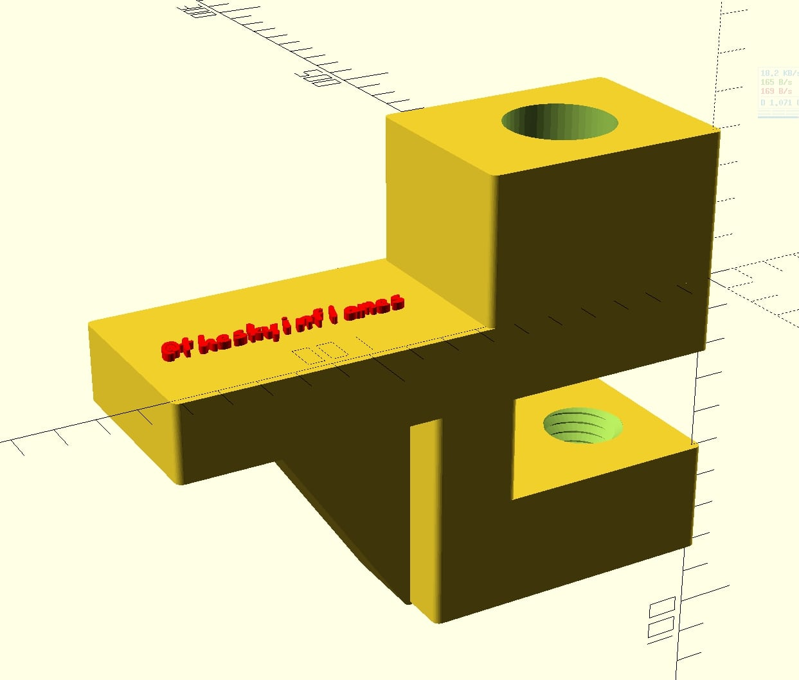
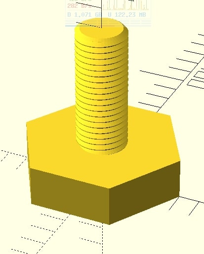

# lamp_hold (WIP)!

## Be careful! this is still a wip !

Table hold for lamp modeled with [OpenSCAD](https://www.openscad.org/)

I've used [Cuiso](www.thingiverse.com/thing:3131126) lib for modeling screws and [WriteScad](https://github.com/rohieb/Write.scad) for add the text.

